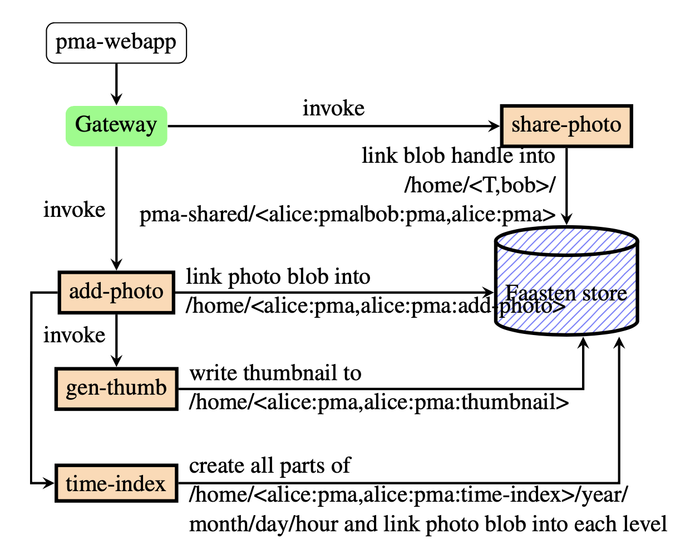
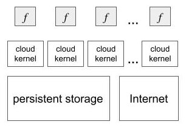
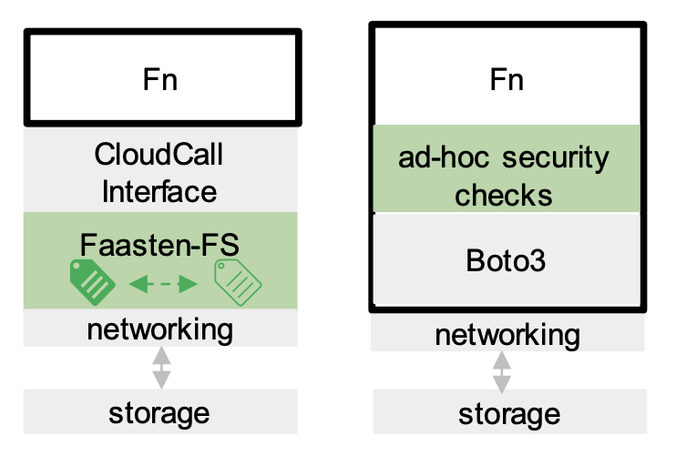

# What is Faasten?
Faasten is a research Function-as-a-Service (FaaS) system. Faasten advocates that to solve the problem
of securing end-user data in FaaS applications,
the FaaS system should offer coherent end-user-oriented security assurances.

# Motivating Example: Photo Management
The end-to-end security assurance that Alice's private photo and its derived data (thumbnails) or metadata (the time index)
stay private to Alice should be easy to achieve. Sharing should be possible through explicit requests.

{: width="50%"}
*Thumbnail and time index generation for each uploaded photo. A photo can be marked as sharable.*

# Design Overview
Faasten defines a distributed *cloud kernel* architecture that
abstracts the network and the persistent storage and enforces *information flow control*
(IFC).

Concretely, the abstraction is a file-system Faasten-FS. Faasten-FS consists of files, blobs, directories,
faceted directories, gates, and services. Data are files (mutable) and blobs (immutable). Metadata (data discovery
and data security policies) are directories and faceted directories. Privilege transfers (invoking another function
and accessing the network) are gates and services.

{: width="50%"}
*Functions make CloudCalls to call into the cloud kernel, removing ad-hoc security checks in non-Faasten
FaaS applications*

(Note that *the cloud kernel simply offers invocation functionality and does not
consider scheduling-related security concerns.*)
